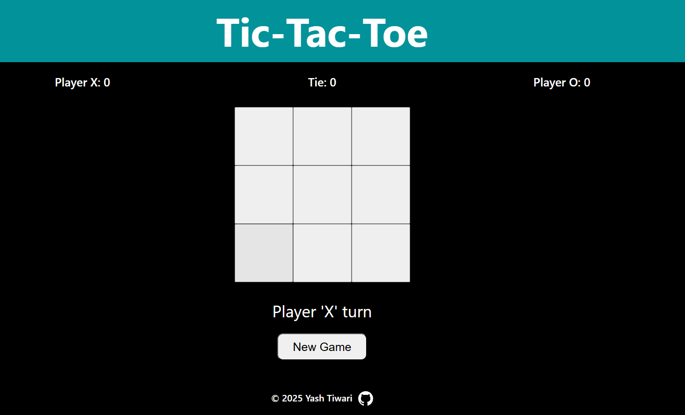

# Tic Tac Toe - JavaScript DOM Project

A clean, responsive **Tic Tac Toe** game built using vanilla JavaScript, HTML, and CSS. This is a beginner-to-intermediate level project ideal for practicing **DOM manipulation**, **modular JS**, and **event handling**.

## Features

- Player vs Player (X and O)
- Score tracking (wins, ties)
- Win & tie detection
- Reset game without refreshing
- Clean, responsive UI with media queries

## Demo

[Play Live](https://your-live-link.com)

## Technologies Used

- HTML5
- CSS3
- JavaScript (ES6+)
- Module Pattern
